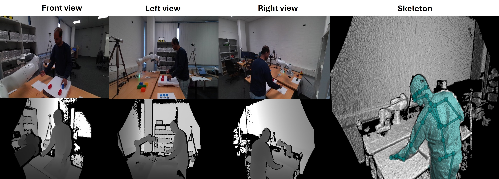

<h1>MHRC: A Multimodal Human-Robot Collaboration Dataset for Human Motion Estimation</h1>
<h3> <i>Sakif Hossain, Jörg P. Müller, and Madhumitha Kesavan</i></h3>
<h4> <i>Clausthal University of Technology, Germany</i></h4>
 
 

 <h3> Abstract </h3>  

Robots are being increasingly introduced into human spaces to support and aid them. This, in turn, requires robots to interact, communicate, and collaborate with humans frequently. Again, robots need to understand and predict human behavior to collaborate safely and efficiently. Machine learning-based models are typically used to estimate human motion, and they require suitable datasets. However, typical human motion datasets focus on everyday actions and are not tailored to the human-robot collaboration (HRC) context. Again, existing human-robot datasets involve specific, complex industrial tasks, focus on single tasks, and have little robot involvement. Therefore, in this paper, we present a multimodal, simple task-based HRC dataset. This dataset provides RGB, depth, and 3D skeleton data from 10 participants (5 repetitions each) performing a block arrangement task in collaboration with a Franka Emika Panda robot. The dataset contains a total of 2190 samples, each containing 40 frames for each data modality.

### Dataset description

 
### Get the data

[Download data](https://zenodo.org/uploads/17311081)

### Citing
 If you use our code, please cite our work (**TBD**)
